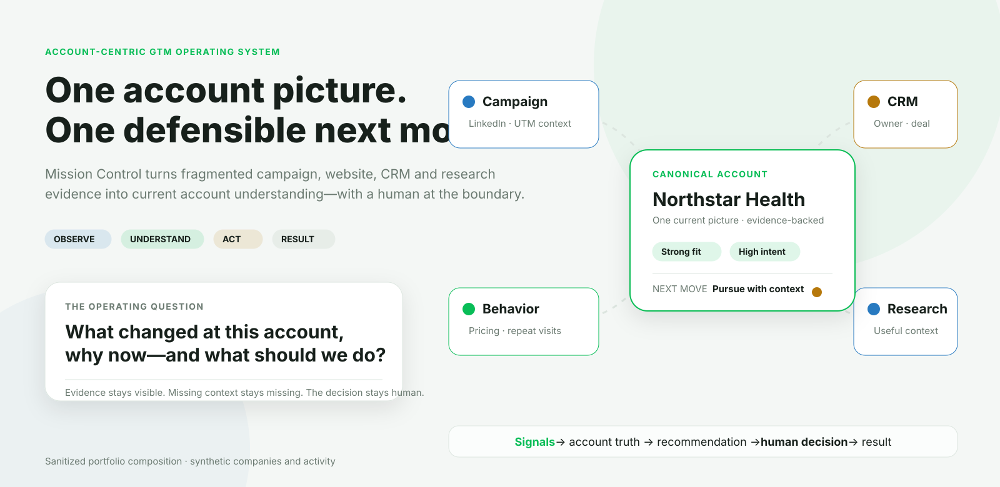

# DRUID GTM Mission Control

### The account-centric GTM engine behind a clearer answer to: *what deserves our attention now?*

An internal product initiative designed and built by **Mihail Lupu** to turn fragmented GTM evidence into one current account picture, an explainable recommendation and a human-owned next move.

 

<picture>
  <source media="(prefers-color-scheme: dark)" srcset="assets/hero-dark.svg">
  <source media="(prefers-color-scheme: light)" srcset="assets/hero-light.svg">
  
</picture>

Public portfolio composition using synthetic companies and activity. No customer or production data is shown.

## The problem was never a lack of signals

A modern GTM team can see website sessions in analytics, contacts and opportunities in its CRM, anonymous-company activity in a de-anonymization tool, campaign responses in another system and research somewhere else entirely. Each tool can accurately describe its own fragment while nobody can confidently describe the account.

That leaves the operator doing the difficult work manually: deciding whether five records refer to the same company, working out what changed, separating actual buying evidence from ordinary CRM state, checking whether the company fits the ICP, finding a real person to contact and remembering what happened after someone acted.

Mission Control exists to make that account-level reasoning explicit. It is not a CRM replacement and it is not another dashboard that puts a score beside every company. It is an operating system for moving from messy evidence to an accountable GTM decision.

## One account, even when the evidence arrives in pieces

The system treats the canonical account—not the lead, event or provider—as the durable unit of context. New evidence can make the story clearer, reveal a conflict or leave an important question unanswered. It should never silently create certainty.

A campaign touch does not become a person merely because that would be convenient. A company property does not become intent because it came from a CRM. A research finding does not become confirmed account truth because an AI produced a plausible sentence. Mission Control keeps these things related without pretending they are interchangeable.

## What using it feels like

The operator starts with a Daily Brief rather than an ingestion dashboard. It shows which canonical accounts moved during the selected period, what they did, which campaign or source context travelled with the activity and whether the current evidence changes what deserves attention.

From there, the workflow is intentionally human:

1. **See what changed.** Account-bound behavioral activity is reconciled into a time-based view. Raw capture volume is available, but it does not get to masquerade as account movement.
2. **Open the account story.** The operator sees why the account matters now, current company and CRM truth, people, activity, assessment, missing context and the evidence behind each claim.
3. **Inspect the recommendation.** Mission Control proposes a posture and next move using a deterministic, versioned policy. It also shows its reasons, blockers and confidence.
4. **Apply judgment.** The operator accepts, modifies or rejects the recommendation and records why. That response is tied to the exact recommendation version it answered.
5. **Prepare the work.** An accepted next step can produce a grounded email, LinkedIn draft or call brief. Recipient checks and prospect-safety rules prevent the system from guessing a person or exposing surveillance language.
6. **Approve the boundary.** Preparation, approval, execution handoff and provider-confirmed execution remain separate states.
7. **Keep the result.** Decisions, actions, outcomes, cost status and reporting limitations become part of the operating history.

## The system recommends. The operator decides.

Recommendations are deliberately not an LLM improvising a next step. They are a versioned projection over current account truth, production evaluation, verified people and unresolved attention items.

That distinction matters. If the evidence changes, the recommendation fingerprint changes too; an old approval cannot quietly satisfy a new recommendation. If a contact cannot be verified, Mission Control will not guess an email address. If the safest answer is research, watch or no action, those are valid outcomes rather than conversion failures.

This is also why the product does not create a grand autonomous “Action” object and declare victory. The current Actions workspace groups accounts by the job in front of the operator:

| Operator job | What it means |
| --- | --- |
| **Needs my decision** | A current recommendation or unresolved review item still needs human judgment. |
| **Ready for the next step** | The operator answered the recommendation and a safe preparation step is available. |
| **Research needed** | The account may be relevant, but the evidence is not sufficient for responsible outreach. |
| **Waiting / watching** | Nothing needs to happen now, or the operator explicitly chose not to act. |

## Campaign tracking and GA4 answer different questions

GA4 is useful because it measures aggregate website traffic across both anonymous and known visitors. It can answer whether a campaign created reach, sessions and engagement. It cannot, by itself, provide One Account Truth.

Mission Control therefore keeps two views deliberately separate:

- **GA4 remains the source of truth for aggregate traffic and campaign performance.**
- **Campaign and UTM context travels with identifiable behavioral evidence** when that evidence can be defensibly associated with a lead, person or canonical account.

The next product step is to deepen this connection so a campaign can be followed beyond top-of-funnel traffic: which leads and accounts arrived, which became active, what the system recommended, what a human chose to do and which outcomes were later confirmed.

This does **not** mean forcing anonymous GA4 sessions into named accounts or claiming multi-touch attribution that the evidence cannot support. It means carrying real campaign context forward when identity becomes known, while preserving the boundary between aggregate analytics and account-level evidence.

## Account understanding has layers

An account page is organized around the operator’s commercial questions, not around the database tables underneath it.

| Question | Product surface |
| --- | --- |
| **Why does this account matter now?** | A current account narrative grounded in recent movement, assessment and unresolved attention. |
| **What do we actually know?** | Canonical company and CRM truth, manual confirmations, agreement, conflict and provenance. |
| **Who do we know?** | Verified people, their available contact paths and selected acquisition context. |
| **Is it worth pursuing?** | Versioned ICP evaluation across Fit, Intent, identity, ability to act and eligibility. |
| **What changed?** | A chronological account activity view with source, campaign, page and timestamp context. |
| **What is missing?** | Unknown fields, blockers, stale evidence and research questions remain visible. |
| **What should happen next?** | An explainable recommendation followed by explicit human response controls. |

The operator can also test an account against another ICP, but the preview remains separate from the official production evaluation. This makes exploration possible without rewriting operational truth.

## One Account Truth is a behavior, not a slogan

Provider data enters the system as atomic observations with provenance. Identity evidence is used to bind those observations to an account. Comparable firmographic and CRM candidates can then be reconciled into current truth using explicit source authority, confidence and timestamp rules.

When sources agree, the agreement remains visible. When they conflict, the winning evidence and conflicting evidence remain visible. A current operator-confirmed fact has explicit authority, but its history is immutable rather than overwritten.

The same restraint appears in the UI:

- **Not configured** is different from **not evaluated**.
- **Unknown** is different from **no**.
- Missing behavioral coverage is unavailable, not zero.
- CRM ownership is not intent.
- Research is evidence, not automatically fact.
- A recommendation is not authorization.
- A handoff is not a confirmed result.

## The loop continues after the decision

Mission Control can assemble a campaign-period view spanning accounts requiring attention, recommendations, human decisions, actions, outcomes, cost status, attribution coverage and explicit data limitations. The same operating context supports two different outputs:

- a readable PDF for leadership and campaign review;
- an operational CSV for downstream execution or analysis, including the reporting period and record type on every row.

LinkedIn execution currently remains a supervised export-and-import workflow. Mission Control can prepare the approved rows; a person exports the CSV and imports it into Dripify. The product does not claim that an external platform received, delivered or completed an action until there is evidence that it did.

## What AI contributes

AI is useful here, but it is not the product’s source of authority.

DeepSeek currently supports two bounded interpretation jobs: an on-demand Account Brain analysis and a summary of the selected reporting period. Both operate over evidence the system already has. They do not resolve identity, promote canonical truth, perform the official ICP evaluation, decide recommendation policy or authorize execution.

This division is intentional. Language models are good at compressing a complicated account history into something a person can read. Deterministic policy, immutable history and explicit human approval are better foundations for deciding what the business is allowed to do next.

## Connected to the real GTM stack

The product is already connected to operational systems rather than being a static prototype.

| System | Current role in Mission Control |
| --- | --- |
| **HubSpot** | Read-only company and contact identity, firmographics, CRM state, ownership, opportunity and selected acquisition context. |
| **RB2B** | Identifiable website activity and person/company resolution, orchestrated through n8n. |
| **Client Radar** | On-demand company research with persisted request state, returned evidence and completed-result inspection. |
| **GA4** | Aggregate website and campaign traffic, intentionally separate from named-account activity. |
| **Google Sheets** | Transitional campaign-reporting and operational interchange surface. |
| **n8n** | Production ingestion and orchestration around external signals and context refresh. |
| **Tavily** | Restricted ingestion of DRUID’s own public product material for reviewed product knowledge. |
| **Clawd** | Separate consumer of immutable, explicitly approved execution handoffs. |

The provider model is open by design, but a name appearing in a future-provider vocabulary is not the same as a live integration. Dealfront, Cognism, PostHog, Salesforge and broad autonomous channel execution are not presented here as current capabilities.

## Under the product surface

Only after the human workflow is clear does the architecture become useful.

The implementation is a TypeScript monorepo with a React/Vite operator workspace, an Express API, PostgreSQL with Drizzle, pure identity/observation/evaluation packages and append-only operational ledgers.

Several design choices carry most of the technical weight:

- provider-specific payloads stop at adapters; the observation and reconciliation core is provider-neutral;
- idempotency and identity resolution are deterministic rather than probabilistic guesses;
- production evaluations persist the exact evidence snapshot and evaluator version they used;
- recommendations are computed from current canonical state using a named policy version;
- operator responses are append-only and tied to a recommendation fingerprint;
- approval freezes provenance into an immutable execution handoff;
- Postgres constraints and triggers enforce important lifecycle and immutability rules beneath the application layer;
- browser-session routes, signal-ingestion routes and execution-consumer routes use separate authorization boundaries.

## What is implemented—and what is still being built

Mission Control is a working internal product in active development, not a finished commercial platform.

**Implemented today**

- canonical accounts, aliases, people and account-bound observations;
- provider-neutral evidence classes and deterministic fact reconciliation;
- HubSpot, RB2B, Client Radar and GA4 integration paths;
- editable, versioned ICP profiles and explainable production evaluations;
- Daily Brief, account movement, Accounts, Needs Attention and Account investigation;
- deterministic recommendations and persisted operator responses;
- operator Actions workspace and grounded message/call preparation;
- explicit approval and immutable execution handoffs;
- campaign reporting, operational CSV, LinkedIn CSV and PDF export;
- reviewed DRUID product knowledge and on-demand AI summaries.

**Now being deepened**

- campaign-to-lead and campaign-to-account tracking alongside GA4;
- stronger continuity from identifiable campaign touch through decision, action and outcome;
- completion of the supervised action-and-feedback loop across external providers;
- clearer leadership reporting over the canonical operating model.

**Deliberately not claimed**

- a mature first-class Campaign Setup domain;
- universal attribution across anonymous traffic;
- autonomous outbound;
- research automatically promoted to truth;
- every planned data provider already connected.

## Why this project is in my portfolio

I started Mission Control because the operating problem was familiar: companies buy increasingly capable GTM tools, but the person responsible for acting still has to reconstruct the truth by hand.

The project let me work across the full product problem rather than stopping at a concept deck. I defined the product thesis and information architecture, designed the evidence and account model, shaped the evaluation and recommendation behavior, built the human-control workflow, connected real systems, implemented the product and kept revisiting the uncomfortable edge cases where software is tempted to sound more certain than the data allows.

That combination is what I wanted to demonstrate here: product and GTM judgment, enough technical depth to make the model real, and the discipline to design around what the system can actually prove.

---

This repository is a sanitized portfolio case study, not the operational source distribution and not official DRUID product documentation. Visuals use synthetic companies, people, campaign names, activity and metrics. DRUID and related marks belong to their respective owner.
