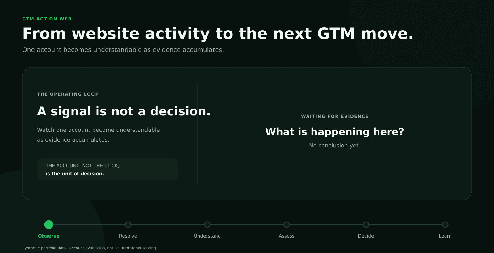
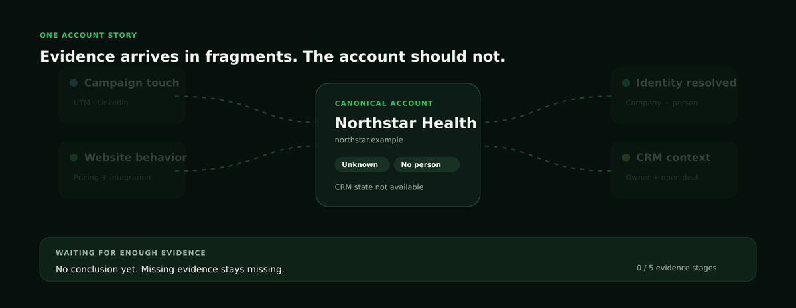
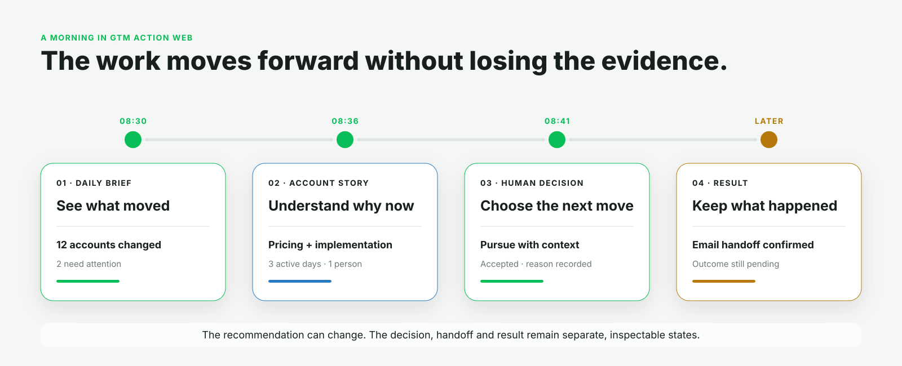
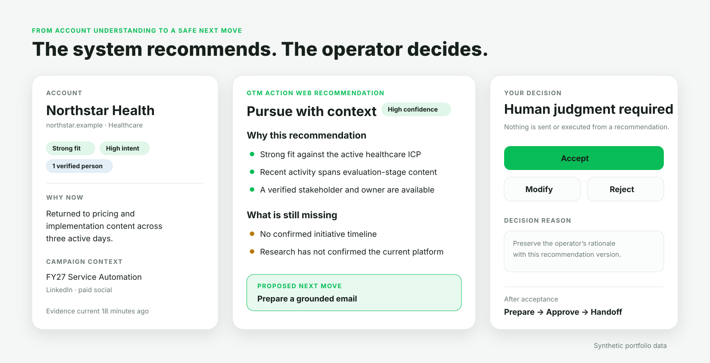
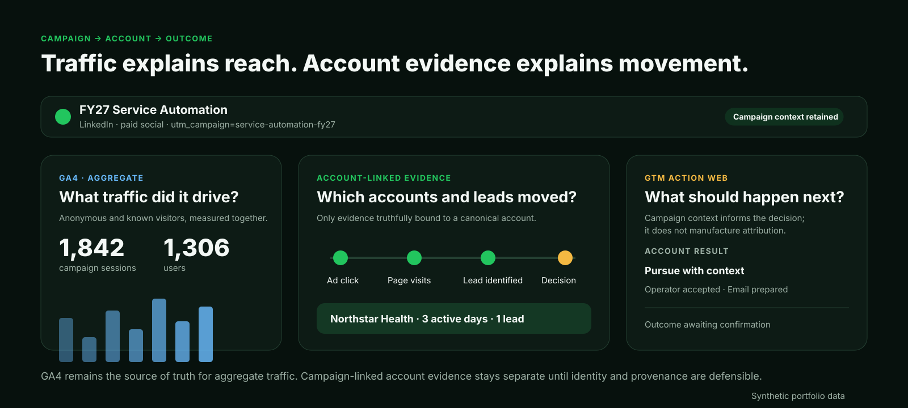
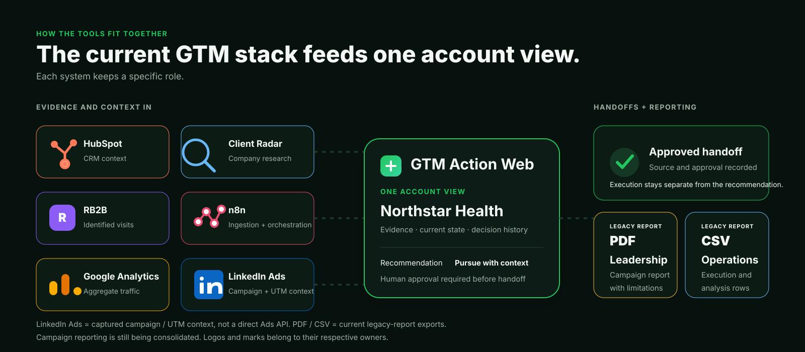
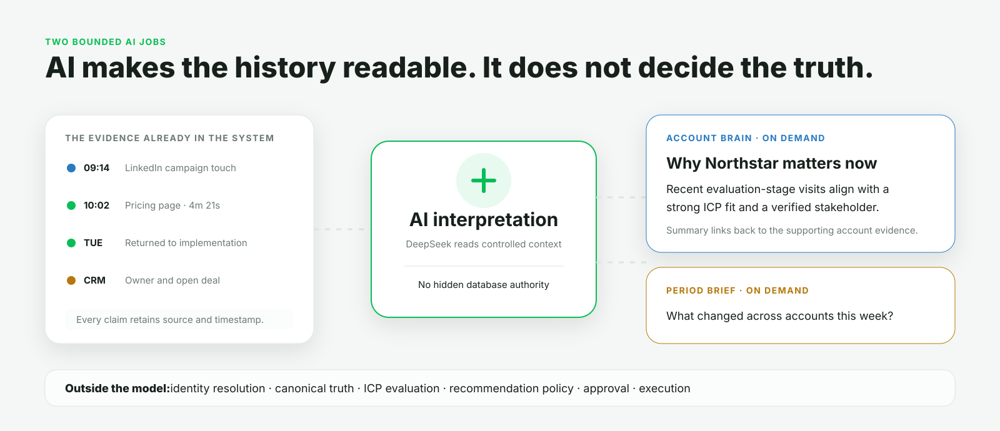
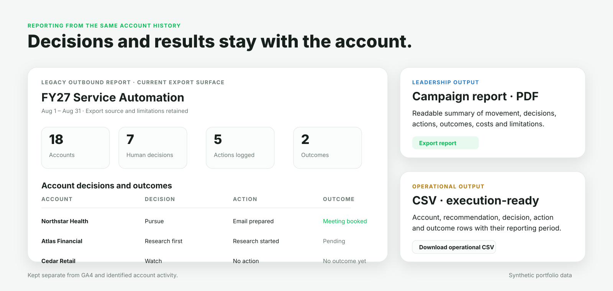
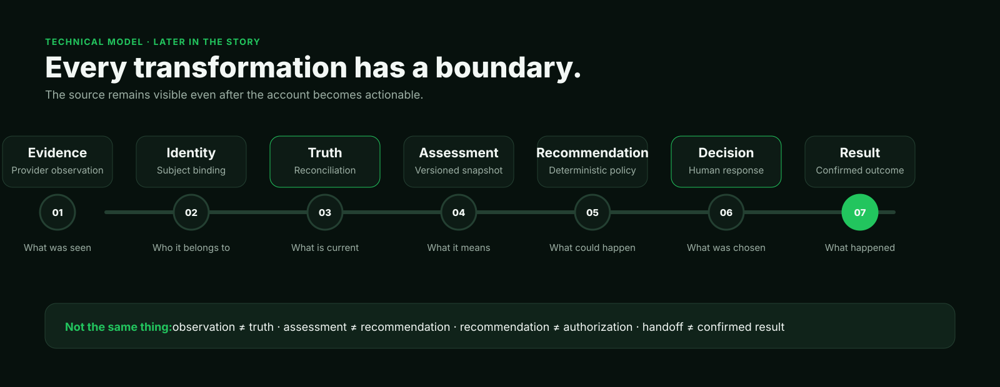
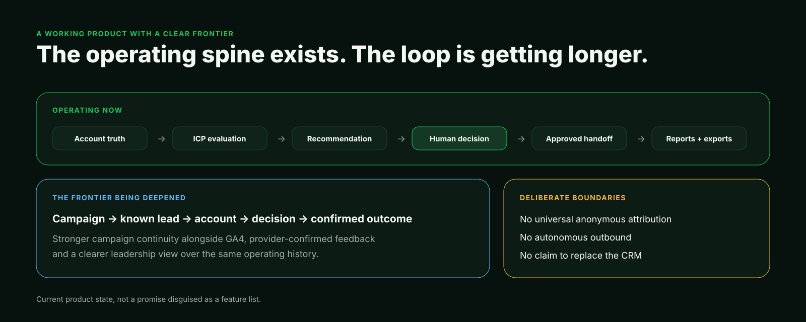

# GTM Action Web

### **Turn website activity into clear marketing and sales actions**

**See which accounts are active, why they matter, and what to do next.**

  

GTM Action Web brings together paid and organic website activity, campaign data, identified visitors, CRM information and research. When a visitor or company can be identified with enough evidence, the activity is added to that account alongside activity from other people at the same organization.

The system then checks how well the account matches the available ICPs and whether its recent activity suggests intent. It recommends a next step for marketing or sales, but a person decides whether to proceed. The decision and any later result stay with the account.

**One visit is not treated as buying intent. The recommendation comes from the account’s combined evidence.**

*Working internal product designed and built by [Mihail Lupu](https://github.com/MLupu88). Public portfolio presentation using synthetic data and sanitized visuals.*

---

## Why I built it

Website analytics showed traffic, campaign platforms showed clicks, visitor-identification tools sometimes named a person or company, and HubSpot showed contacts, owners and opportunities. Each tool answered its own question, but someone still had to put everything together before deciding what to do.

> **What is actually happening at this account, and what should we do about it now?**

GTM Action Web does that work once and keeps the result current. It connects campaign and content data to identified behavior, groups activity by account, checks the account against the appropriate ICP and suggests what should happen next. Strong fit and recent activity may lead to sales review, an owner alert or prepared outreach. Earlier or incomplete activity may lead to nurture, research, retargeting or simply watching the account.

It does not replace the CRM, analytics or campaign tools. It sits between them and the people expected to act. The account is the center because one company’s story often involves several people, visits and systems.

---

## One account, even when signals arrive separately

A campaign click, a return visit, an identified person and an open opportunity may all belong to the same account. They still come from different sources and should not automatically be treated as equally reliable.

  

GTM Action Web keeps the source and time of each observation. It records how a visitor was matched to a person or company and compares overlapping facts before updating the account. New evidence may confirm something, contradict it or leave the question open. If information is missing, the product shows it as unknown.

This gives separate signals somewhere useful to accumulate without hiding where they came from.

---

## From movement to action

The Daily Brief starts with the accounts that changed, what caused the change and which ones now need a decision. Data-ingestion details remain available, but they are not the first thing the user sees.

  

Opening an account shows the current company and CRM information, identified people, recent activity, campaign context, ICP assessment, missing information and the source behind each item. The official evaluation uses a published ICP version. A user can test another ICP as a preview without changing the official result.

The Actions page groups accounts by the work required: **decide, prepare, research or watch**. The user does not have to translate a score into a task.

---

## Recommendations still require a person

  

A recommendation uses the current account data, the official ICP evaluation, identified people and any unresolved review items. It shows the suggested route, the reasons behind it, anything blocking action and the proposed next step.

The user can accept, change or reject it and record why. That response stays linked to the exact recommendation it answered, so a later recommendation cannot inherit an earlier approval by accident.

An accepted next step can prepare an outreach draft or call brief using the account evidence. Preparation, approval, handoff and confirmed execution remain separate. If the recipient cannot be verified, the workflow stops rather than guessing. Research, watch and no action are also valid choices.

---

## GA4 and account activity answer different questions

GA4 measures total website traffic: reach, sessions, users and engagement across anonymous and known visitors. It cannot tell the full story of a named account by itself.

Campaign and UTM data stay attached to identified activity when the system can reliably connect that activity to a lead, person or account.

  

The goal is to follow a campaign beyond traffic totals: **which known leads and accounts arrived, what they looked at, whether several people from the account became active, which ICP matched, what the system recommended and what happened afterward**.

Anonymous GA4 sessions are not forced into named accounts, and the product does not claim universal multi-touch attribution. Aggregate traffic and identified account activity remain separate until the connection can be supported.

---

## How the tools fit together

Each connected system keeps a specific role. GTM Action Web brings the useful parts together around the account rather than trying to replace the original tools.

  

HubSpot provides CRM context. Google Analytics provides aggregate traffic. RB2B contributes identified website activity. Client Radar contributes research. n8n handles ingestion and refresh. LinkedIn Ads campaign and UTM data can travel with captured activity, but there is no direct LinkedIn Ads API integration today.

<strong>Current integration roles</strong>

| System | Current role in GTM Action Web |
| --- | --- |
| **HubSpot** | Read-only company and contact identity, firmographics, CRM state, ownership, opportunities and selected acquisition context. |
| **RB2B + n8n** | Identifiable website activity, person/company resolution and production ingestion orchestration. |
| **Client Radar** | On-demand company research with persisted requests, returned evidence and completed-result inspection. |
| **Google Analytics 4** | Aggregate website and campaign traffic, intentionally separate from named-account activity. |
| **LinkedIn Ads** | Campaign/source context carried through captured UTM or campaign evidence; direct Ads API connectivity is not claimed. |
| **Tavily** | Restricted ingestion of the company’s own public material for reviewed product knowledge. |
| **DeepSeek** | Limited Account Brain and period summaries based on evidence already in the product. |
| **Clawd** | Separate consumer of immutable, explicitly approved execution handoffs. |

The operational repository still contains an older Google Sheets reporting path and manual Dripify export logic. These are legacy features, not core integrations. Dealfront, Cognism, PostHog and Salesforge are also not presented as current capabilities.

---

## Where AI helps

AI currently has two limited jobs in the product.

The **Account Brain** summarizes why an account may matter now. The **Period Brief** summarizes what changed during a selected period. Both use information already stored in the system and link the user back to the supporting evidence.

  

The model does not resolve identity, update verified account facts, perform the official ICP evaluation, choose the recommendation rules or approve execution. It helps the user read the history; it does not make the final decision.

---

## Decisions and results stay with the account

The product records what was recommended, what the user chose, what was handed off and what was later confirmed.

  

The current Reports page keeps **GA4 traffic** separate from **identified account activity**. It also includes an older outbound report with PDF and CSV exports. That report shows its source and limitations rather than presenting the data as verified account history.

The next step is to build leadership and operational reports from the same campaign → lead → account → decision → outcome history used in the product. This should remove the need to reconstruct the account story again for a report or meeting.

---

## How it works

The implementation is a TypeScript monorepo with a React/Vite operator workspace, an Express API, PostgreSQL with Drizzle, explicit contracts and pure packages for identity, observations, reconciliation and evaluation.

  

The implementation keeps several responsibilities separate:

- provider-specific payloads stop at adapters;
- identity resolution and idempotency are deterministic;
- production evaluations retain the evidence snapshot and evaluator version they used;
- recommendations have a named policy version and a stable fingerprint;
- operator responses and execution handoffs are append-only;
- database constraints protect important lifecycle and immutability rules beneath the UI;
- browser, ingestion and execution-consumer routes have separate authorization boundaries.

These boundaries prevent a raw observation from becoming a verified fact, an assessment from becoming an automatic action, or a handoff from being reported as a completed result.

---

## What works today—and what comes next

GTM Action Web is a working internal product. It already supports account records, source-backed evidence, identity resolution, ICP evaluation, recommendations, user decisions, prepared actions, approval handoffs, GA4 reporting and identified activity history.

  

The main work now is improving the connection from campaign to known lead and account, then from an approved action to a confirmed result. Campaign setup and consolidated account-based reporting are not finished yet.

---

## Why this is in my portfolio

<table>
<tr>
<td width="150" valign="top">
  
</td>
<td valign="top">

### Mihail Lupu

I work in product marketing, and projects like GTM Action Web are how I make myself earn stronger opinions about technical products. I have spent more than a decade around automation, conversational AI and generative AI, and I teach design thinking for GenAI at the Bucharest University of Economic Studies.

I do not find “marketer who can code” particularly interesting as an identity. The useful part is getting close enough to the system that product decisions, data choices, UX trade-offs and positioning stop being abstract.

GTM Action Web started with a practical question: when paid or organic activity brings someone to the website, can we tell which account is moving and what marketing or sales should do next? Building it exposed the harder questions behind that simple idea: how certain are we about identity, how do visits from several people become one account story, how should the account be assessed across multiple ICPs, who decides the action, and how do we record what happened afterwards?

That is why it belongs here. I worked across the product model, information architecture, data rules, workflows, integrations, implementation and positioning.

> **Understanding the system makes the product story better. Building the system makes the opinions harder to fake.**

[GitHub profile](https://github.com/MLupu88)

</td>
</tr>
</table>

### Related work

- **ChannelOS** — an AI-native operating system for a partner organization, built around relationship memory, attribution, targets and leadership reporting.
- **[AI Agent Sudo](https://github.com/MLupu88/ai-agent-sudo)** — a provider-neutral authorization layer that returns `allow`, `deny` or `require_approval` before an agent executes a tool.
- **[VoiceWire](https://github.com/MLupu88/voicewire)** — a local diagnostic engine combining packet/media evidence with agent traces to explain voice-AI latency and failure boundaries.

---

This repository is a sanitized portfolio case study, not the operational source distribution or official company documentation. Visuals use synthetic companies, people, campaign names, activity and metrics. Product and company marks belong to their respective owners.
